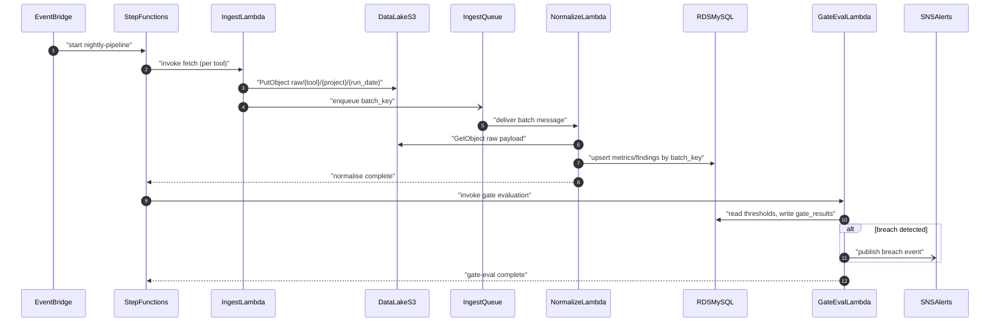

# Solution Design: Quality Dashboard
Data Sensitivity: Public | approved_at: 2025-06-10T18:00:00Z

## Design Overview
The platform runs a nightly Step Functions pipeline that pulls raw tool exports into a partitioned S3 data lake, normalises them into a MySQL (RDS) relational model keyed for idempotent re-runs, evaluates release-gate thresholds, and fans out breach notifications via SNS. A Cognito-authenticated SPA (S3/CloudFront) calls API Gateway/Lambda to read portfolio/project/release data (open to all authenticated users) and to write thresholds/gate overrides (restricted to ReleaseManager/QALead Cognito groups). CI/CD pipelines call the same read API to enforce release gates. All ingestion batches are keyed by (tool, project, run_date) so retries upsert rather than duplicate.

## Resource Inventory
| Resource | AWS Service | Naming Pattern | Purpose |
|----------|-------------|-----------------|---------|
| Data lake bucket | Amazon S3 | `qd-datalake-{env}` | Raw tool payloads/files, partitioned `raw/{tool}/{project}/{run_date}/` |
| Frontend hosting bucket | Amazon S3 | `qd-frontend-{env}` | Static SPA assets, CloudFront origin |
| CDN distribution | Amazon CloudFront | `qd-cdn-{env}` | HTTPS delivery of SPA |
| User pool | Amazon Cognito | `qd-userpool-{env}` | Federated auth via OIDC (Okta/Azure AD); groups `Viewer`/`ReleaseManager`/`QALead` |
| REST API | Amazon API Gateway | `qd-api-{env}` | Dashboard backend, Cognito authorizer |
| Ingestion Lambda (API pull) | AWS Lambda | `qd-ingest-api-{tool}-{env}` (sonarqube, gitlab) | Pull REST APIs into S3 |
| Ingestion Lambda (SFTP pull) | AWS Lambda | `qd-ingest-sftp-{tool}-{env}` (fortify, trivy, tricentis) | SFTP-pull exports into S3 |
| Normalisation Lambda | AWS Lambda | `qd-normalize-{tool}-{env}` | Parse raw S3 objects, upsert RDS |
| Threshold evaluation Lambda | AWS Lambda | `qd-gate-eval-{env}` | Compute gate status, write `gate_results` |
| Slack subscriber Lambda | AWS Lambda | `qd-notify-slack-{env}` | SNS → Slack webhook post |
| API handler Lambdas | AWS Lambda | `qd-api-{resource}-{env}` (projects, releases, portfolio, findings, thresholds) | API Gateway integration per resource group |
| Orchestrator | AWS Step Functions | `qd-nightly-pipeline-{env}` | fetch → normalise → gate-eval → notify |
| Scheduler | Amazon EventBridge | `qd-nightly-trigger-{env}` | Cron ~02:00 daily |
| Ingestion buffer/DLQ | Amazon SQS | `qd-ingest-queue-{env}` / `qd-ingest-dlq-{env}` | Buffer + retry between ingestion and normalisation |
| Alerting topics | Amazon SNS | `qd-alerts-{project}-{env}` (per-project opt-in), `qd-ops-alerts-{env}` (pipeline/ops) | Threshold-breach and pipeline-failure notifications |
| Unified data store | Amazon RDS (MySQL, db.t3.micro) | `qd-db-{env}` | Metrics, findings, lifecycle, thresholds, gate results, user actions |
| Secrets | AWS Secrets Manager | `qd/{tool}/credentials-{env}`, `qd/slack/webhook-{env}`, `qd/db/app-user-{env}` | Tool tokens, SFTP keys, Slack webhook, DB creds |
| Config params | SSM Parameter Store | `/qd/{env}/config/{key}` | Tool endpoints, default thresholds |
| Log groups | Amazon CloudWatch | `/qd/{component}-{env}` | Ingestion/API logs, 12-month retention |
| Tracing | AWS X-Ray | n/a (enabled on API stage `qd-api-{env}`) | API Gateway → Lambda → RDS trace |

## Data Model
| Table / Store | Key Schema | Key Attributes | Notes |
|----------------|------------|-----------------|-------|
| `projects` | PK `project_id` | `name`, `repo_url`, `created_at` | Master list from GitLab/config |
| `releases` | PK `release_id`, FK `project_id` | `release_name`, `target_date`, `status` | One row per release cut |
| `ingestion_batches` | PK `batch_key` = `{tool}#{project_id}#{run_date}` | `s3_path`, `status`, `attempt_count`, `updated_at` | Idempotency ledger; upsert on retry |
| `metrics` | PK `metric_id`, unique idx (`project_id`,`tool`,`run_date`,`metric_type`) | `release_id`, `value`, `unit` | Upsert on unique idx for re-run safety |
| `findings` | PK `finding_id` = hash(`tool`,`project_id`,`external_finding_id`) | `severity`, `status`, `first_seen`, `last_seen` | Deterministic ID prevents duplicate findings on re-ingest |
| `finding_lifecycle_events` | PK `event_id`, FK `finding_id` | `event_type`, `event_ts`, `source_run` | Append-only audit of state transitions |
| `thresholds` | PK `threshold_id`, FK `project_id` | `metric_type`, `operator`, `threshold_value`, `updated_by`, `updated_at` | Editable by ReleaseManager/QALead only |
| `gate_results` | PK `gate_result_id`, unique idx (`release_id`,`run_date`) | `status`, `failed_metrics`, `evaluated_at` | Authoritative source for CI/CD gate check |
| `user_actions` | PK `action_id` | `user_id`, `action_type`, `target_ref`, `ts` | Audit trail per FR-19 |

## API / Interface Contracts
| Endpoint or Interface | Method | Request | Response | Auth |
|------------------------|--------|---------|----------|------|
| `/projects` | GET | query: none | list of `{project_id,name,status}` | Cognito (any authenticated) |
| `/projects/{id}/dashboard` | GET | path `id` | metrics, findings summary, gate status | Cognito (any authenticated) |
| `/portfolio/summary` | GET | query `top=20` | executive risk-ranked project list | Cognito (any authenticated) |
| `/findings` | GET | query `project_id`, `status`, `severity` | paginated finding list | Cognito (any authenticated) |
| `/releases/{id}/gate-status` | GET | path `id` | `{status, failed_metrics, evaluated_at}` | Cognito (any authenticated) |
| `/releases/{id}/gate-check` | GET | path `id`, header API key or Cognito token | `{status: pass\|fail\|unknown}` | Cognito or service token (CI/CD caller) |
| `/projects/{id}/thresholds` | PUT | body `{metric_type,operator,threshold_value}` | updated threshold record | Cognito group `ReleaseManager` or `QALead` |
| `/notifications/subscriptions` | POST | body `{project_id,channel,target}` | subscription confirmation | Cognito (any authenticated) |

## IAM & Access Design
| Principal | Resource | Actions | Justification |
|-----------|----------|---------|----------------|
| `qd-ingest-api-*` / `qd-ingest-sftp-*` execution role | `qd-datalake-{env}` (prefix `raw/{tool}/*`), Secrets Manager tool secrets, SQS `qd-ingest-queue-{env}` | `s3:PutObject`, `secretsmanager:GetSecretValue`, `sqs:SendMessage` | Write-only raw landing, scoped per-tool secret access |
| `qd-normalize-*` execution role | `qd-datalake-{env}` (read `raw/*`), RDS `qd-db-{env}` via Secrets Manager DB creds, SQS receive+DLQ | `s3:GetObject`, `secretsmanager:GetSecretValue`, `rds-db:connect`, `sqs:ReceiveMessage`,`sqs:DeleteMessage` | Parse and upsert normalised rows only |
| `qd-gate-eval` execution role | RDS `qd-db-{env}` (thresholds, gate_results, metrics), SNS `qd-alerts-*` | `rds-db:connect`, `sns:Publish` | Compute + persist gate status, publish breach |
| `qd-notify-slack` execution role | Secrets Manager Slack webhook, SNS subscription | `secretsmanager:GetSecretValue`, `sns:Subscribe`(managed) | Post breach messages to Slack |
| `qd-api-*` execution roles | RDS `qd-db-{env}` (scoped per resource group), Cognito group claim (read from JWT) | `rds-db:connect` (read for Viewer paths; read/write for threshold path) | Least-privilege per API resource; write path additionally checks Cognito group in Lambda authorizer logic |
| Cognito group `Viewer` | API Gateway resources: all GET routes | `execute-api:Invoke` on GET methods | FR-15 portfolio-wide read access |
| Cognito group `ReleaseManager`, `QALead` | API Gateway `PUT /projects/{id}/thresholds` | `execute-api:Invoke` on PUT method | Threshold/gate config restricted per Security Design |
| `qd-nightly-pipeline` Step Functions role | Lambdas listed above, EventBridge trigger | `lambda:InvokeFunction`, `states:StartExecution` | Orchestrates fetch→normalise→gate→notify |
| CI/CD caller (external) | `/releases/{id}/gate-check` | `execute-api:Invoke` (read-only) | FR-11 authoritative, queryable gate status |

## Sequence Detail

1. EventBridge triggers `qd-nightly-pipeline` at ~02:00.
2. Step Functions invokes per-tool ingestion Lambdas in parallel (API pull and SFTP pull).
3. Ingestion Lambdas write raw payloads to `qd-datalake-{env}` under `raw/{tool}/{project}/{run_date}` (idempotent path = batch key).
4. Ingestion Lambda enqueues batch reference to `qd-ingest-queue-{env}`; failures route to `qd-ingest-dlq-{env}` after max retries.
5. Normalisation Lambda consumes queue message, reads the raw S3 object.
6. Normalisation Lambda upserts `metrics`/`findings`/`finding_lifecycle_events` in RDS keyed on the unique (`tool`,`project_id`,`run_date`) / deterministic `finding_id`, updating `ingestion_batches` status.
7. Step Functions invokes `qd-gate-eval` once all tool normalisations for the run report complete.
8. Gate-eval Lambda reads project thresholds, computes pass/fail per metric, writes `gate_results` (must land within 5 min of ingestion completion per NFR-06).
9. On breach, gate-eval publishes to the project's `qd-alerts-{project}` SNS topic; email subscribers notified directly, `qd-notify-slack` posts to the project's Slack webhook.
10. CloudWatch alarms watch Step Functions execution status and elapsed time against the 06:00 SLA, alerting `qd-ops-alerts-{env}` on failure/risk.

**Dashboard read/write flow**
1. User authenticates via Cognito, redirected to corporate OIDC; Cognito issues JWT with group claim.
2. Browser loads SPA from CloudFront (`qd-cdn-{env}`) backed by `qd-frontend-{env}`.
3. SPA calls `qd-api-{env}` with bearer JWT; API Gateway Cognito authorizer validates token and group claim.
4. GET routes (`/projects`, `/portfolio/summary`, `/findings`, `/releases/{id}/gate-status`) are served to any authenticated group; Lambda queries `qd-db-{env}` read-only.
5. `PUT /projects/{id}/thresholds` is authorized only for `ReleaseManager`/`QALead` groups (checked in Lambda from JWT claim); on success, Lambda writes `thresholds` and appends `user_actions`.
6. CI/CD caller hits `GET /releases/{id}/gate-check`, Lambda returns latest `gate_results.status` to block/allow release (FR-11).

## Error Handling & Observability
| Concern | Approach |
|---------|----------|
| Retries/idempotency | Ingestion writes are keyed by deterministic `batch_key` (S3 path + `ingestion_batches` row); normalisation upserts on unique index so replays overwrite, not duplicate. SQS redrive policy (max 3 attempts) routes exhausted messages to `qd-ingest-dlq-{env}`. |
| Failure alerting | CloudWatch Alarms on Step Functions `ExecutionsFailed`, Lambda `Errors`/`Throttles`, and SQS `ApproximateNumberOfMessagesVisible` on the DLQ, all publishing to `qd-ops-alerts-{env}` (separate from project breach topics). |
| Logging | Structured JSON logs from every Lambda to `/qd/{component}-{env}` CloudWatch Log Group; 12-month retention per compliance NFR. |
| Tracing | AWS X-Ray enabled on `qd-api-{env}` stage and instrumented in API/normalisation Lambdas to trace API Gateway → Lambda → RDS latency and pinpoint SLA risk. |

## Open Engineering Decisions
| ID | Decision | Options | Recommendation |
|----|----------|---------|-----------------|
| OED-01 | Slack webhook secret rotation cadence | Manual quarterly rotation vs. automated Secrets Manager rotation Lambda | Manual quarterly for MVP; revisit if webhook volume grows |
| OED-02 | RDS Multi-AZ / scaling trigger | Stay single-AZ db.t3.micro vs. upgrade path defined now | Stay single-AZ per architecture MVP scope; define upgrade runbook post-launch |
| OED-03 | Threshold change versioning | Overwrite in place vs. append-only history table | Append-only history recommended for audit strength; needs confirmation before build |
| OED-04 | GitLab webhook migration (Phase 2) | Keep polling indefinitely vs. plan webhook cutover | Out of scope for this design; flagged for Phase 2 per architecture C-04 |
